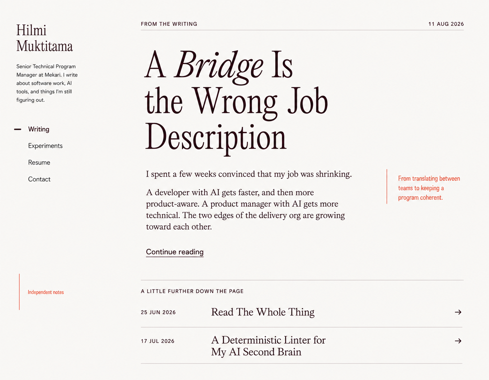
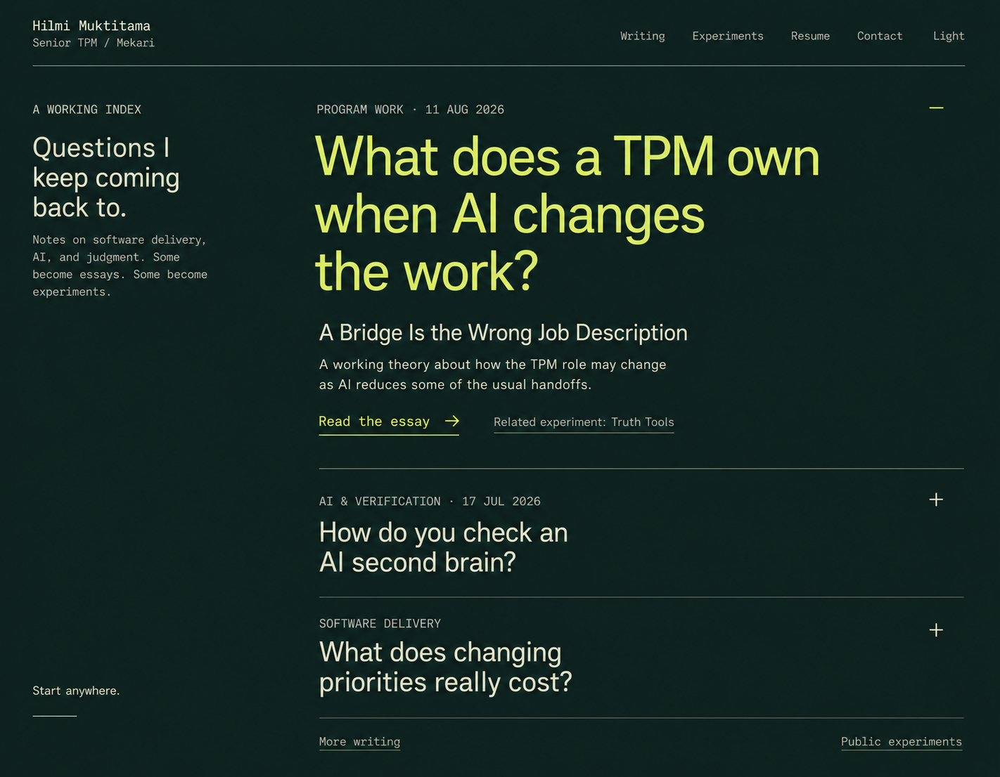
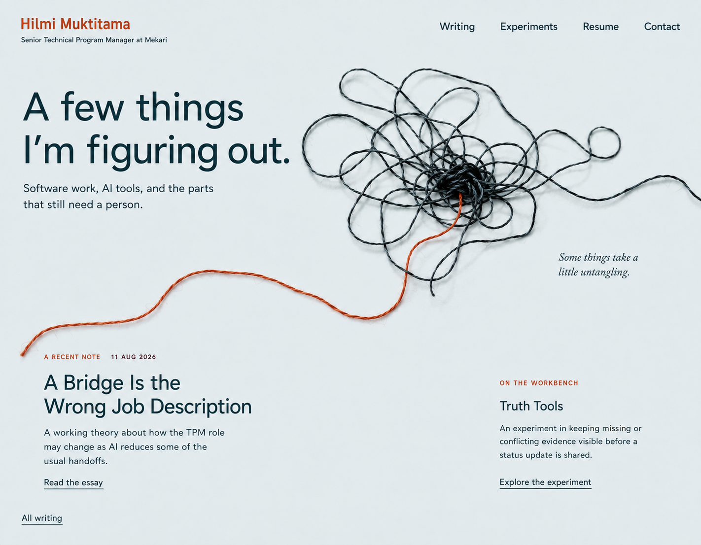

# Three directions for Hilmi Muktitama's site

Date: 2026-09-05. Status: **3. Loose Ends selected by Hilmi and implemented in the existing Astro site.**

These images preserve the three alternatives explored before implementation. Their numbers match the order in which the generated images appeared in the task. Hilmi selected the third image. [The current design direction](../../design-direction.md) records that decision and its whole-site implementation; the other two images remain unselected explorations.

## The problem to solve

The current draft's oversized condensed introduction occupies almost the entire first desktop viewport. Its strongest distinguishing material—the author's actual writing—comes later. Cobalt section bands, coral emphasis, large principle numbers, and a slogan-led hierarchy supply most of the visual identity. Those treatments do little to express what makes this particular author interesting.

The content suggests a more specific identity: someone who writes candidly about uncertainty, verification, the changing TPM role, and the costs of software work. Readers should encounter that voice early. Career history should remain easy to find, and experimental projects should retain their honest scope.

Grounding: inspected the existing homepage, layout, styles, writing and work indexes, résumé, representative article and project content, the prior design board, and the running homepage in the Codex in-app browser. The browser capture is retained in the task; the earlier board is at `../../visual-qa/approved-home-redesign.png`. No external design reference or trend survey was used.

## 1. Open Journal

**Premise:** the homepage is the opening page of a real essay. The author's identity remains in a narrow rail while a reading column and occasional margin annotations establish the site's character.

Visitors can immediately start *A Bridge Is the Wrong Job Description*, including the candid opening, “I spent a few weeks convinced that my job was shrinking.” A small archive below offers another place to begin. This makes the author's voice visible through actual writing.

**Visual system:** near-white, oxblood text, a small amount of cinnabar; Newsreader paired with Hanken Grotesk; an asymmetric author rail, comfortable prose, and annotations that explain rather than decorate. The concept contains no imagery.

**Distinctive behavior:** reading continues from the homepage into the essay. Related work sits in the margins when it adds useful context. Keep the home excerpt short enough that the full-essay link is visible early.

**Tradeoff:** this is the clearest direction for a writer, but a visitor evaluating professional experience has to use the résumé link. It is also the quietest visual departure; it should be chosen for the reading experience rather than novelty alone.

## 2. Question Index

**Premise:** the site is organized around questions the author is working through. Essays and experiments become different ways of exploring the same question.

The opening question, “What does a TPM own when AI changes the work?”, reveals the existing essay and a related Truth Tools link. Other questions lead to the AI second-brain and reprioritization essays. These are proposed navigation labels, not replacements for article titles or claims that the questions have been definitively answered.

**Visual system:** forest green, pale celery, citron emphasis; Hanken Grotesk and IBM Plex Mono; large sentence-case questions and restrained separators. One disclosure is open, giving both a strong starting point and a visible choice of other topics.

**Distinctive behavior:** expand a question to see a short description and direct reading link. Contextual experiment links connect the author's thinking with what he is trying in public. Keep essential reading links accessible without JavaScript; disclosures must be keyboard operable.

**Tradeoff:** this introduces a small amount of editorial maintenance. Questions and related links need to be curated as writing develops. Long titles and expanded descriptions need careful mobile pacing.

**Initial recommendation during exploration:** this was the strongest conceptual fit for organizing material around questions. Hilmi subsequently chose Loose Ends for the implementation.

## 3. Loose Ends

**Premise:** a custom thread illustration gives the site an identifiable visual language for the messy connective work of software delivery.

A dark tangle releases a vermilion strand toward the writing. The introduction is personal—“A few things I’m figuring out”—and the lower section pairs a real essay with a public experiment. The thread is a visual metaphor, not a process diagram or a claim about outcomes.

**Visual system:** cool blue-gray, petroleum ink, burnt vermilion; Hanken Grotesk and a small amount of Newsreader italic. An open composition gives the illustration room and keeps the content directly on the page.

**Distinctive behavior:** conventional, clear reading and experiment links. A small thread detail can recur at meaningful transitions, such as related reading or the end of an experiment note. It should remain a static identity element unless motion later proves useful.

**Tradeoff:** this is the most immediately recognizable image, but its quality depends on a strong, separate illustration asset. At smaller viewports it must yield space to the writing. Repeating knots everywhere would turn a useful motif into decoration.

## How each direction extends across the site

| Surface | Open Journal | Question Index | Loose Ends |
| --- | --- | --- | --- |
| Home | Latest essay excerpt with author rail and a small archive | Curated questions with a visible essay and related experiment | Personal introduction, thread artwork, one essay and one experiment |
| Writing index | A readable dated contents page, with consistent title and date alignment | Questions linked to the existing titles; retain a chronological archive for completeness | Open typographic archive; keep artwork out of repeated entries |
| Article detail | Narrow reading column, author rail, real footnotes and sparse contextual margins | Quiet reading column; originating question and related writing at the edges | Clear prose and footnotes, with one small identity detail at the end |
| Experiments index | Brief experiment notes with status and repository links | Experiments attached to the questions they explore, plus a complete index | A compact workbench list with honest experiment summaries |
| Experiment detail | Problem, approach, evidence, and limits as an editorial dossier | Explicit question, attempted approach, available evidence, and remaining gaps | Factual experiment note with contextual images only when real assets exist |
| Résumé | A structured appendix with scan-friendly organizations, roles, and dates | A compact, factual work record separate from the question navigation | Clear career chronology with a restrained use of the connecting motif |
| Contact / 404 | Simple text in the shared rail and reading layout | Direct destinations within the shared type system | Familiar navigation and a small identity detail; avoid a decorative obstacle |
| Mobile | Rail becomes a compact masthead; margins join the document flow after their related text | Questions become a full-width vertical list; large type scales down and controls retain usable targets | Crop or reduce the illustration; show useful reading content before decorative continuation |

This table records the proposed extensions. Loose Ends was subsequently implemented across the existing routes; the other columns remain proposals. See the [current QA report](../../../design-qa.md) for the implemented states and checks.

## Content and interaction commitments

- Retain the existing article and project URLs, publication dates, canonical metadata, sitemap behavior, and résumé facts.
- Keep the current tentative, personal writing voice. Do not add fabricated impact numbers, adoption claims, testimonials, portraits, or availability claims.
- Public repositories remain experiments. Make their evidence and evaluation limits easy to inspect.
- Every direction needs intentional light and dark themes. The mockups show one theme each; the selected Loose Ends implementation now includes both themes.
- Preserve keyboard navigation, skip navigation, visible focus, meaningful headings, comfortable prose width, reduced-motion behavior, theme persistence, and functional direct links.
- Keep the homepage's useful reading material visible early. Use real content to check hierarchy rather than designing around short placeholder headlines.

## Implementation handoff

The user selected image 3, Loose Ends. Its implementation uses the existing Astro application, selectable HTML text, and a separate thread illustration. The homepage, shared layout, writing and experiment pages, résumé, contact, and 404 use the selected system.

The image dimensions are concept dimensions, not a responsive specification. The implementation adapts the illustration and content at desktop, intermediate, and mobile widths. Both themes, navigation, reading routes, and the existing browser regression suite are covered by the current QA report.

## Files and generation

The three PNGs in this directory were generated using the built-in Image Gen tool and copied here for future reference. The originals remain in the task's generated-images directory. Each independent generation received the existing visual references, an explicit content brief, its own layout and palette, and the 2026-09-05 date anchor. Earlier proposals present in the image context were explicitly excluded from subsequent directions.

[Prompt briefs and reference mapping](prompts.md) describe the generation inputs. Full literal prompts are retained in the task's Image Gen calls. The proposals were visually inspected after generation. Interactive and responsive verification for the later Loose Ends implementation is recorded separately in the current QA report.
